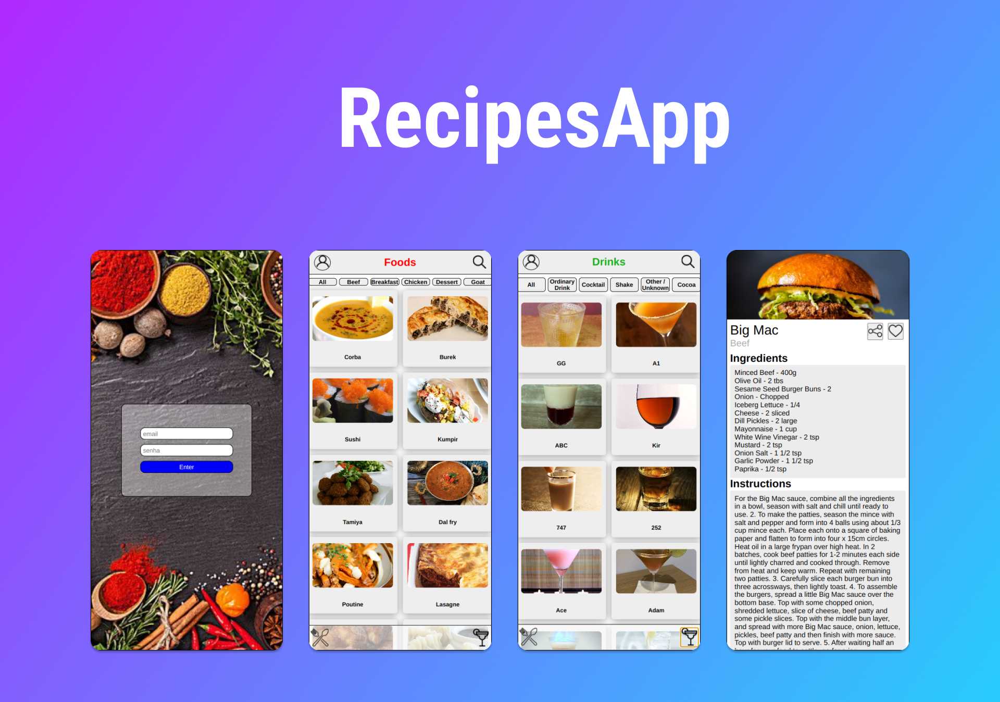

<h1 align="center"> Recipes App </h1>

Projeto de criação de um React App de um app de receitas.
 
Em caso de dicas, observações ou ajuda você pode entrar em contato comigo por qualquer um dos meios disponibilazados na minha bio. 🙂❤️

  <a href="#-tecnologias">Tecnologias</a>&nbsp;&nbsp;&nbsp;|&nbsp;&nbsp;&nbsp;
  <a href="#-projeto">Projeto</a>&nbsp;&nbsp;&nbsp;|&nbsp;&nbsp;&nbsp;
  <a href="#-habilidades">Habilidades</a>

 

  

## 🚀 Tecnologias

Esse projeto foi desenvolvido utilizando as seguintes tecnologias:

- Git e Github
- ReatJs
- Api request
- Context
- React Hooks

## 🚀 Habilidades

Verifica a capacidade de:
- Utilizar _Redux_ para gerenciar estado
- Utilizar a biblioteca _React-Redux_
- Utilizar a Context API do _React_ para gerenciar estado
- Utilizar o _React Hook useState_
- Utilizar o _React Hook useContext_
- Utilizar o _React Hook useEffect_

## 💻 Projeto

  Este é um projeto em grupo de um app de receitas com foco para dispositivos móveis, todo feito em React, utilizando duas APIs distintas, onde é possível ver, buscar, favoritar e até mesmo compartilhar as receitas de suas comidas e bebidas.

<h2 align="center">Feito com ♥ by ogabrielfef</h2>